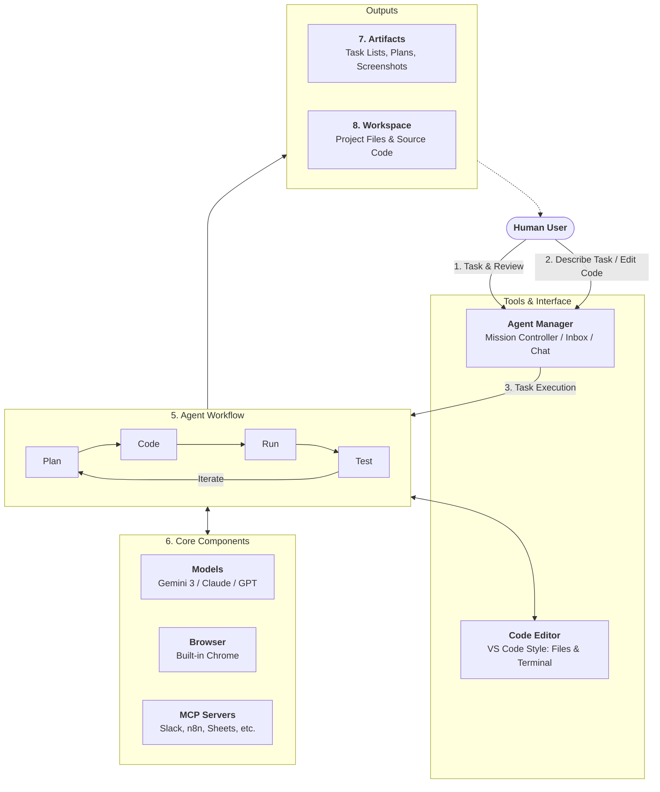

# Mastering Antigravity

This repository is dedicated to documenting the journey of mastering **Antigravity**, following the tutorial: [Master 80% of Antigravity](https://youtu.be/mOqhhDXUgUo?si=kGA3R3apqtF4P_OM).

## Repository Setup
- **Creation**: Manually created on GitHub.
- **Cloning**: Manually cloned via GitHub Desktop to the local machine.

## Learning Journal
This journal tracks the progress of the tutorial, documenting what was learned, what Antigravity (AI) performed, and what the USER performed at each step.

---

## How Antigravity Works

Antigravity operates as an autonomous coding partner, bridging the gap between human intent and functional software through a sophisticated loop of planning, execution, and verification.

### Core Principles

1.  **Human-Centric Start**: The process always begins with the human user providing a task and eventually reviewing the results.
2.  **Collaborative Control**: Users can describe tasks in natural language and directly edit code alongside the agent.
3.  **The Agent Manager**: This acts as the "Mission Controller" or Inbox, where chat, progress tracking, and task descriptions live.
4.  **Integrated Environment**: A full-featured code editor (VS Code style) provides access to files, code, and a live terminal.
5.  **Autonomous Workflow**: Once a task is assigned, the agent follows a continuous loop: **Plan $\rightarrow$ Code $\rightarrow$ Run $\rightarrow$ Test**.
6.  **Powerful Components**: The agent leverages three primary pillars:
    *   **Models**: Advanced LLMs like Gemini 3, Claude, or GPT.
    *   **Browser**: A built-in Chrome instance for web research and testing.
    *   **MCP Servers**: Connections to external tools like Slack, n8n, or Google Sheets.
7.  **Evidence-Based Progress**: The agent generates **Artifacts** such as task lists, implementation plans, screenshots, and screen recordings to document its journey.
8.  **Workspace Integration**: Everything the agent builds is written directly to the project **Workspace**, managing files and code in real-time.

---

### Step 1: Initial Setup
*Status: Completed*

- **User Actions**:
    - Created the repository on GitHub.
    - Cloned the repository using GitHub Desktop.
    - Instructed Antigravity to initialize the README and documentation structure.
- **Antigravity Actions**:
    - Analyzed the workspace.
    - Created the initial `README.md` with the project context.
- **Key Learnings**:
    - Setting up the environment for collaborative AI development.

---

### Step 2: Building the Personal Finance Dashboard MVP
*Status: Completed (with known functional gaps)*

**Objective**: Build a personal finance dashboard web app strictly following requirements and mock data structures provided in `gemini.md`, while remaining perfectly aligned to visual rules defined in `brandGuidelines.md`.

#### Detailed Step-by-Step Execution:
1. **Research & Planning**: 
    - Ingested the `gemini.md` architecture and MVP instructions.
    - Read `brandGuidelines.md` capturing hex codes, border-radii, typography, and card stylings.
    - Proposed a Vite + React stack using Vanilla CSS (no Tailwind) to ensure full control over the specific brand variables.
    - Presented an `implementation_plan.md` to the user and awaited feedback and approval.
2. **Project Initialization**:
    - Triggered `npx create-vite` to scaffold a React app inside the `./app` subfolder.
    - Ran `npm install` for core packages and dependencies (`react-router-dom`, `recharts`, `lucide-react`, `date-fns`).
3. **Brand Translation & State Management**:
    - Encoded the brand hex values (JM Dark Blue, Light Blue, Navy) into pure CSS variables in `index.css`.
    - Bootstrapped responsive components (Cards, Badges, Buttons, Navbars).
    - Designed `FinanceContext.jsx` using React Context API to manage global state with a custom `useLocalStorage` hook so data persists through browser refresh.
4. **MVP Page Assembly**:
    - **Dashboard**: Assembled the core metrics, injected dynamic `recharts` (Income Bar Chart, Budget Donut Chart), and layered recent transactions widgets.
    - **Transactions Page**: Built out the transaction table featuring visual search/filters placeholders.
    - **Wallet Page**: Generated stylized masked-card previews mimicking real Visa/Mastercards using raw CSS shapes and layouts.
    - **Goals Page**: Developed a functional progress bar layout tracking target savings.
5. **Verification**:
    - Booted the local Vite dev server.
    - Used the autonomous `browser_subagent` to physically navigate the live deployed application on `localhost:5173`.
    - Generated a screen recording walking through the basic routing and Dark/Light mode functionalities.

#### What Went Right:
- **Flawless UI Translation**: The application's aesthetics matched the *JM Solutionss* brand perfectly without relying on external UI libraries. CSS variables combined with React created a fast, highly-premium aesthetic.
- **Routing & Data Resilience**: `react-router-dom` successfully linked the core views, while the `useLocalStorage` hook cleanly held the mock data and survived browser reloads.
- **Autonomous Scaffolding Workflow**: Antigravity smoothly bridged planning to execution, scaffolding the Vite environment directly from the terminal without user intervention (working around execution policy errors by routing via `cmd.exe`).
- **Dark Mode Implementation**: Using `data-theme` selectors created a perfectly accessible, highly vibrant dark theme that retained the core brand accents.

#### What Went Wrong (Current Limitations):
- **Unwired Interactive Buttons**: While the UI renders perfectly, functional components like "Add Transaction", "Add Card", and "Add Funds" buttons are strictly cosmetic. They do not trigger modals or update the state variables properly.
- **Missing Pages**: The `Analytics` and `Reports` routes were explicitly left as bare placeholders and do not render any actual data logic.
- **Shallow Verification**: The automated testing via the browser subagent only performed "Happy Path" navigation. It clicked through the sidebar tabs and dark mode but completely failed to test form inputs, state mutations, or error handling. Essentially, the test validated that the app *painted*, but not that the app truly *worked*.
